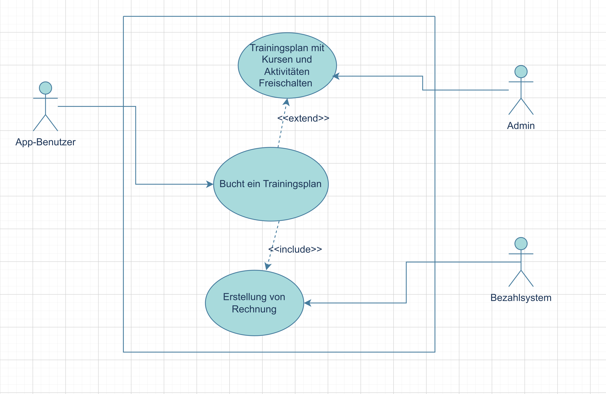
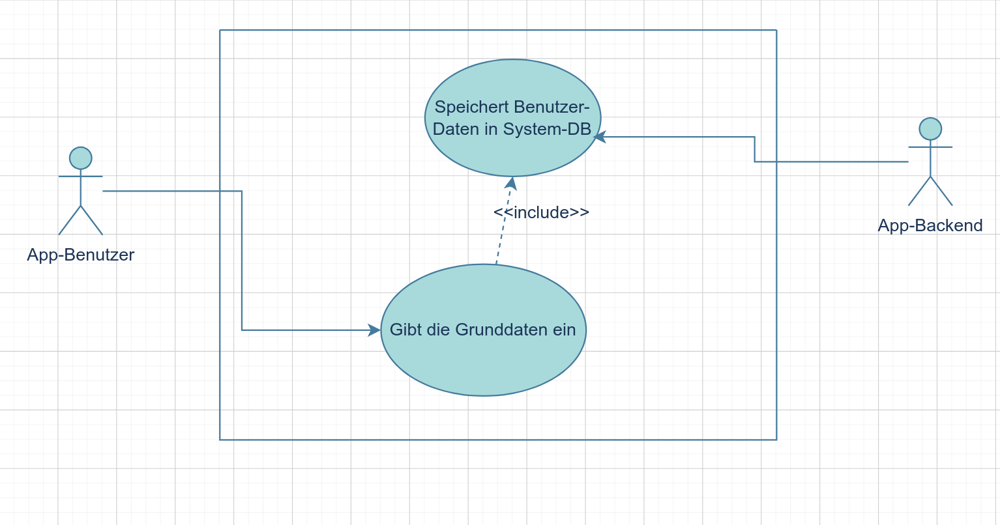
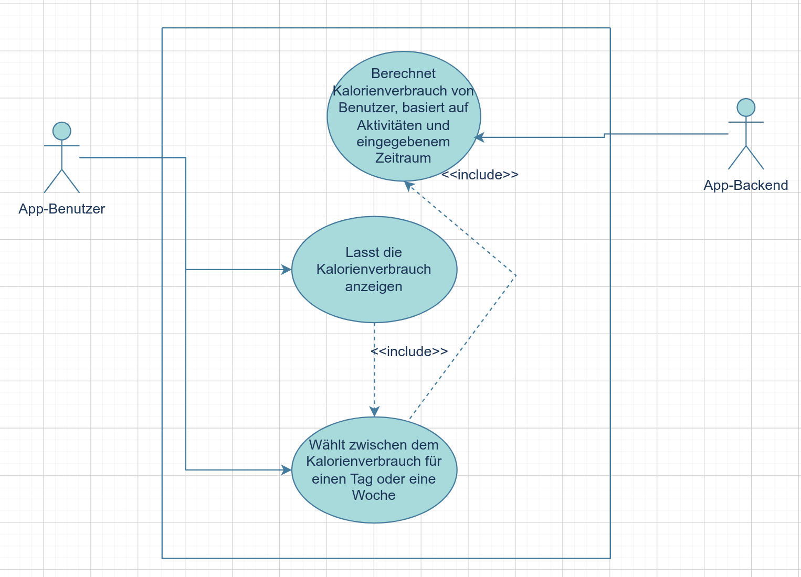
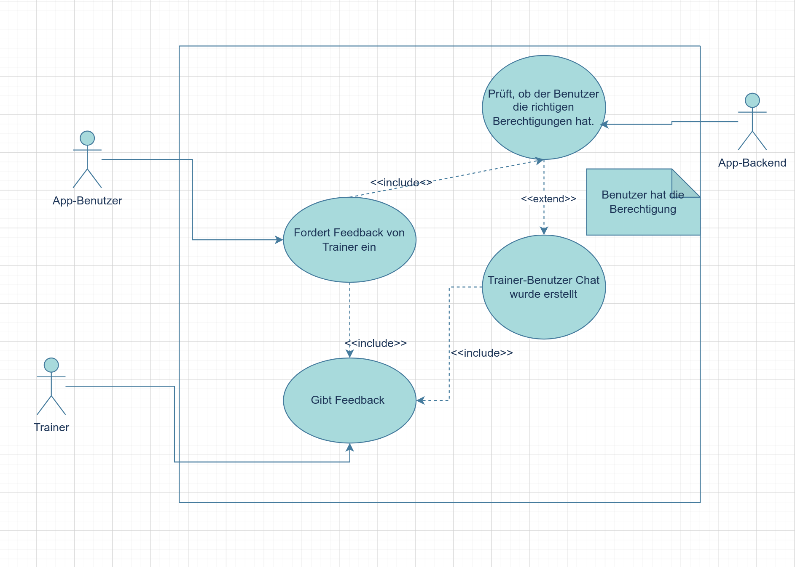
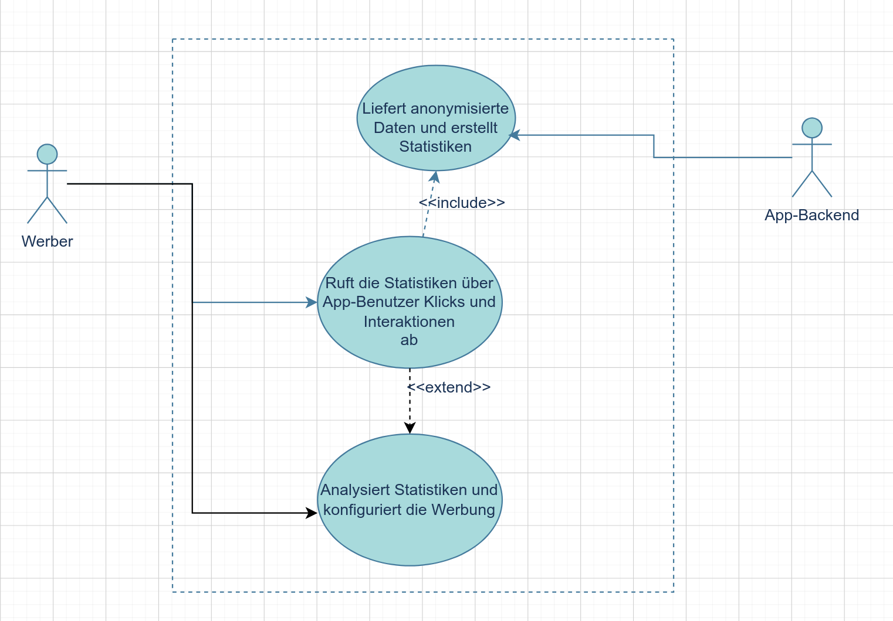
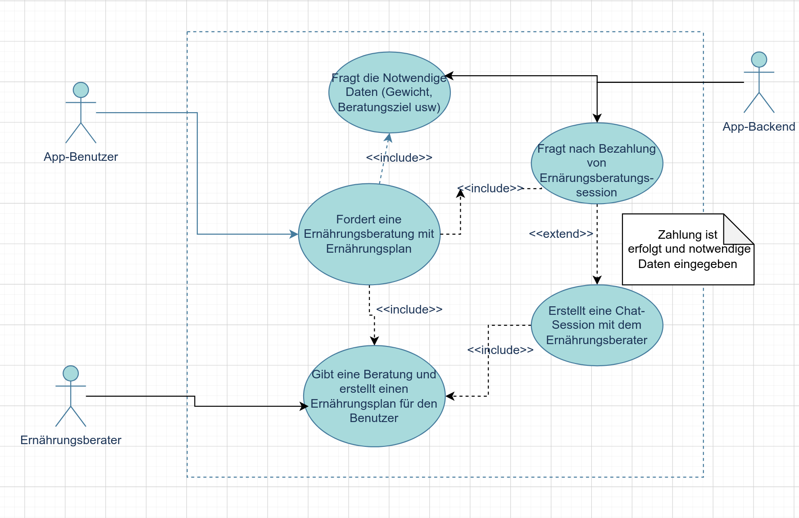

# Aufgabe 1: Akteure identifizieren & visuelle Darstellung

## 🎭 Akteure der Fitness-App

| Akteur | Beschreibung                                                                                                | Hauptziele |
|---|-------------------------------------------------------------------------------------------------------------|---|
| App-Benutzer | Die Hauptperson, die die App verwendet                                                                      | Tracken von Workouts, Ernährung oder Fortschritt |
| Trainer/Coach | Kann mehrere App-Benutzer überwachen und je nach bezahlten Plan Feedback geben usw.                         | Trainingspläne erstellen, Fortschritte überwachen oder Feedback geben |
| Administrator | Verwaltung von Benutzerkontos                                                                               | Löschen/modifizieren/aktivieren usw. von allen Kontos |
| Ernährungsberater | Erstellt Kurse für unterschiedliche Ernährungsprobleme, macht private Ernährungsberatungen                  | Erstellung und Überwachung von Ernährungspläne für den Nutzer |
| Psychotherapeut | Erstellt Motivationskurse für Benutzern, macht private Sessions falls notwendig (Motivation, Esstörung usw) | Benutzer helfen an Ziel zu kommen und immer motiviert zu bleiben |
|Werber| Marketing-Team, das Werbung innerhalb der App platziert und verwaltet                                       | Die Sichtbarkeit von Produkten, Dienstleistungen oder Marken durch gezielte Werbung in der App erhöhen und die Interaktion mit Nutzern fördern|

