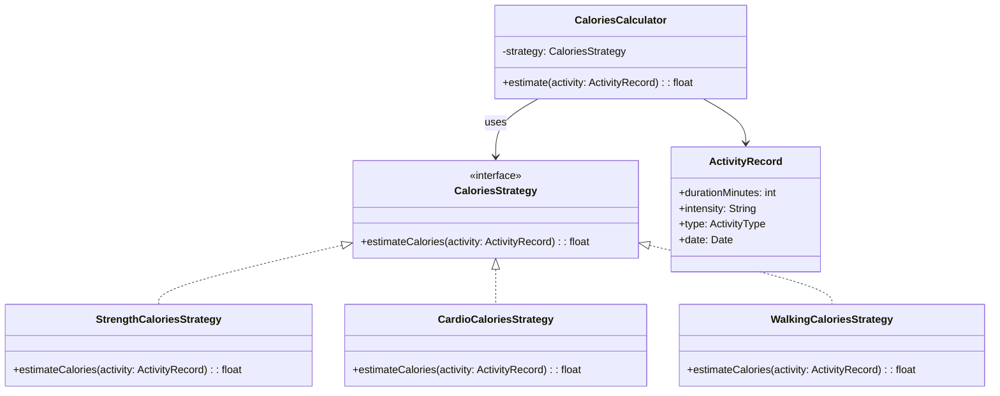

# Design Patterns – Auswahl für das Projekt „FitnessTracker“

## a) Pattern-Recherche

### 1. Strategy Pattern

**Wofür?**  
Das Strategy Pattern kapselt austauschbare Algorithmen hinter einer gemeinsamen Schnittstelle.  
Der aufrufende Code (Context) kennt nur das Interface, nicht die konkrete Implementierung.  
So kann das Verhalten zur Laufzeit oder zur Konfigurationszeit gewechselt werden.

**Beispiel im FitnessTracker:**  
- Kalorienberechnung unterscheidet sich je nach Aktivitätstyp (z.B.  Krafttraining vs. Ausdauertraining vs. Spazierengehen).  
- Wir definieren ein Interface `CaloriesStrategy` mit einer Methode    `estimateCalories(userProfile, activity)`.  
- Konkrete Strategien:
  - `StrengthCaloriesStrategy`
  - `CardioCaloriesStrategy`
  - `WalkingCaloriesStrategy`
- Der `ActivityService` wählt je nach `ActivityType` die passende Strategy und muss die konkrete Berechnungslogik nicht kennen.

---

### 2. Observer Pattern

**Wofür?**  
Das Observer Pattern informiert mehrere abhängige Objekte (Observer), wenn sich der Zustand eines Subjekts ändert.  
Die Observer registrieren sich beim Subjekt und werden bei Änderungen automatisch benachrichtigt.

**Beispiel im FitnessTracker:**  
- Wenn neue Aktivitäten oder Mahlzeiten gespeichert werden, soll sich die GUI automatisch aktualisieren:
  - Tagesübersicht / Dashboard
  - Diagramme für Kalorienverbrauch und -aufnahme
- `ActivityRepository` (oder ein `ActivityStore`) könnte als „Subject“ fungieren.  
- UI-Komponenten (z.B. `DailyLogView`, `StatsView`) registrieren sich als Observer und bekommen Updates, wenn sich Daten ändern.

---

### 3. Factory Pattern

**Wofür?**  
Das Factory Pattern kapselt die Objekt-Erstellung.  
Der aufrufende Code fragt eine Factory nach einem Objekt und kennt nicht mehr den konkreten Konstruktor.  
Das erleichtert Konfiguration, Austausch von Implementierungen und reduziert Duplikate bei komplexer Objekt-Erzeugung.

**Beispiel im FitnessTracker:**  
- `TrainingFactory` erstellt je nach Eingaben des Users unterschiedliche `ActivityRecord`-Objekte:
  - `ActivityType.STRENGTH`
  - `ActivityType.CARDIO`
  - `ActivityType.WALKING`
- Die Factory setzt z.B. Default-Werte, berechnet Start-/Endzeit oder mappt UI-Auswahl (Dropdown) auf interne Enum-Werte.

---

### 4. Repository Pattern

**Wofür?**  
Das Repository Pattern kapselt den Datenzugriff (CRUD-Operationen) und trennt Domänenlogik von Persistenzlogik.  
Die Fachlogik arbeitet mit Repository-Interfaces, nicht direkt mit SQL oder konkreter Datenbank.

**Beispiel im FitnessTracker:**  
- `ActivityRepository` stellt Methoden bereit wie:
  - `save(ActivityRecord record)`
  - `findByDate(userId, date)`
  - `findAllForUser(userId)`
- Konkrete Implementierung: `SQLiteActivityRepository` (oder später eine andere DB).  
- `ActivityService` benutzt nur das Interface `ActivityRepository` und bleibt dadurch testbar und datenbankunabhängig.

---

## b) Pattern-Auswahl für das Projekt

Wir setzen im Projekt konkret zwei Patterns um:

1. **Strategy Pattern** – für die Kalorienberechnung  
2. **Repository Pattern** – für den Datenzugriff auf Aktivitäten

### 1. Strategy Pattern – Kalorienberechnung

**Problem:**  
Die Kalorienberechnung hängt von mehreren Faktoren ab:
- Aktivitätstyp (Kraft, Ausdauer, Spazieren, evtl. Schwimmen, Radfahren etc.)
- Intensität
- Dauer
- User-Profil (Gewicht, Größe, Alter, Geschlecht, Fitnesslevel)

Wenn man alles in einer großen `if/else`- oder `switch`-Struktur in     `ActivityService` implementiert, wird die Klasse schnell unübersichtlich und schwer erweiterbar.

**Lösung mit Strategy Pattern:**  
- Interface `CaloriesStrategy`
- Konkrete Strategien: `StrengthCaloriesStrategy`, `CardioCaloriesStrategy`, `WalkingCaloriesStrategy`, …
- `ActivityService` oder `CaloriesCalculator` fungiert als Context und wählt die passende Strategy je nach `ActivityType`.

**Beteiligte Klassen/Interfaces (Ausschnitt):**
- `ActivityService`
- `ActivityRecord`
- `CaloriesStrategy` (Interface)
- `StrengthCaloriesStrategy`
- `CardioCaloriesStrategy`
- `WalkingCaloriesStrategy`

### Klassendiagramm (Mermaid)




---

### 2. Repository Pattern – Datenzugriff auf Aktivitäten

**Problem:**  
Zurzeit würde man leicht versucht sein, in `ActivityService` direkt SQL-Queries oder Datenbank-spezifische Aufrufe zu verwenden.  
Das erschwert:
- das Testen (Unit Tests ohne echte DB)
- den Wechsel der Datenbank (z.B. von SQLite auf PostgreSQL oder in die Cloud)
- die Wiederverwendung der Domänenlogik in einer anderen Umgebung (z.B. Web-Backend)

**Lösung mit Repository Pattern:**  
- Interface `ActivityRepository` definiert, welche Operationen auf der Domäne „Aktivität“ benötigt werden.  
- Konkrete Implementierung `SQLiteActivityRepository` nutzt z.B. SQLite (lokale DB auf dem Gerät).  
- `ActivityService` kennt nur das Interface `ActivityRepository` und wird über Dependency Injection mit einer konkreten Implementierung versorgt.

**Beteiligte Klassen/Interfaces (Ausschnitt):**
- `ActivityService`
- `ActivityRepository` 
- `SQLiteActivityRepository` (Implementierung)
- `ActivityRecord`

```mermaid
classDiagram
    class ActivityService {
        -activityRepository: ActivityRepository
        +addActivity(record: ActivityRecord)
        +getDailyActivities(userId, date)
    }

    class ActivityRepository {
        <<interface>>
        +save(record: ActivityRecord)
        +findByDate(userId, date)
        +findAllForUser(userId)
    }

    class SQLiteActivityRepository {
        +save(record: ActivityRecord)
        +findByDate(userId, date)
        +findAllForUser(userId)
    }

    class ActivityRecord {
        +id: long
        +userId: long
        +type: ActivityType
        +duration: int
        +intensity: Intensity
        +date: Date
        +kcal: double
    }

    ActivityService --> ActivityRepository : uses
    ActivityRepository <|-- SQLiteActivityRepository
    ```
---

## c) Pattern-Reflexion

### 1. Warum wurden diese Patterns gewählt?

**Strategy Pattern:**
- Die Kalorienberechnung ist zentral für den FitnessTracker und variiert je nach Aktivitätstyp.  
- Es ist absehbar, dass im Laufe des Projekts weitere Aktivitäten hinzukommen (z.B. Schwimmen, Radfahren).  
- Strategy erlaubt es, neue Berechnungslogiken hinzuzufügen, ohne bestehende Klassen stark anzupassen.

**Repository Pattern:**
- Der FitnessTracker arbeitet intensiv mit persistenten Daten (Aktivitäten, Ernährung, ggf. User-Profil).  
- Eine klare Trennung von Domänenlogik und Datenzugriff ist wichtig für:
  - bessere Testbarkeit (Mock-Repository im Unit Test),
  - spätere Migration auf eine andere Datenbank oder ein Backend-API,
  - saubere Architektur (Single Responsibility Principle).

---

### 2. Erwartete Vorteile

**Strategy Pattern – Vorteile:**
- **Erweiterbarkeit:** Neue Aktivitätstypen können durch neue Strategy-Klassen ergänzt werden.  
- **Wartbarkeit:** Die Berechnungslogik ist aus `ActivityService` ausgelagert und liegt in klar getrennten Klassen.  
- **Testbarkeit:** Jede Strategy kann separat mit Unit-Tests getestet werden.

**Repository Pattern – Vorteile:**
- **Wartbarkeit:** SQL/Datenbank-Code ist gebündelt im Repository statt im ganzen Code verteilt.  
- **Testbarkeit:** `ActivityService` kann mit einem Mock-Repository getestet werden, ohne echte DB.  
- **Austauschbarkeit:** Wechsel der Datenbank-Technologie oder Hinzufügen eines Remote-Backends erfordert nur neue Repository-Implementierungen, kein Umschreiben der Business-Logik.

---

### 3. Mögliche Nachteile

**Strategy Pattern – Nachteile:**
- **Mehr Klassen:** Für jede Variante der Berechnung entsteht eine neue Strategy-Klasse.  
- **Komplexität:** Für kleine Projekte kann die zusätzliche Abstraktion zunächst „over-engineered“ wirken.

**Repository Pattern – Nachteile:**
- **Zusätzlicher Layer:** Es entsteht eine weitere Abstraktionsschicht, die anfangs mehr Code bedeutet.  
- **Overhead in kleinen Projekten:** Wenn das Projekt sehr klein bliebe, könnten einfache direkte DB-Aufrufe weniger Aufwand sein – aber wir akzeptieren den Overhead zugunsten einer sauberen Architektur.

---
