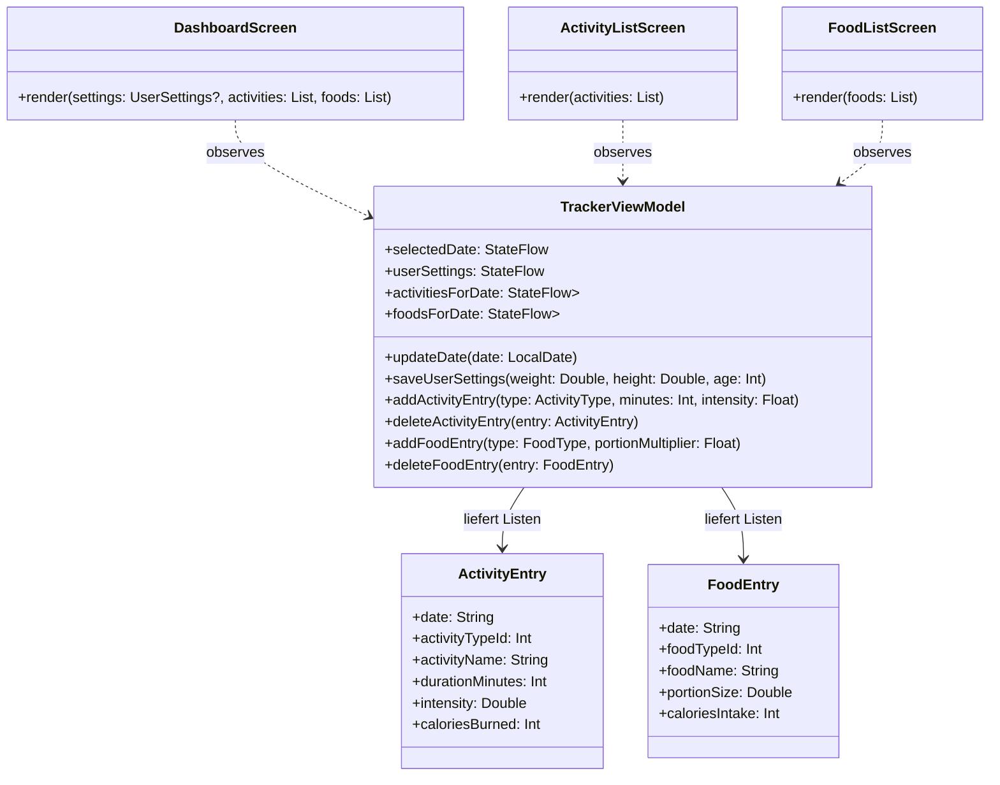
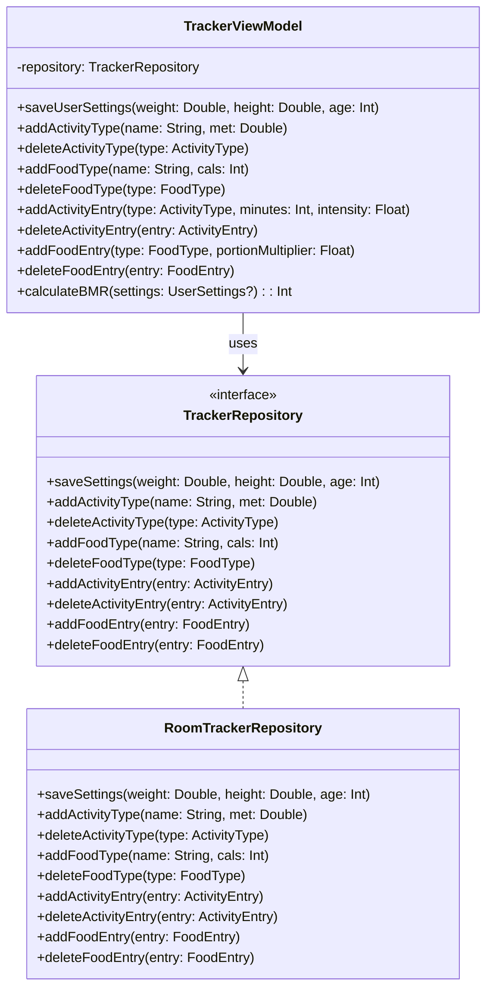

# Design Patterns – Auswahl für das Projekt „FitnessTracker“

## a) Pattern-Recherche

### 1. Strategy Pattern

**Wofür?**  
Das Strategy Pattern kapselt austauschbare Algorithmen hinter einer gemeinsamen Schnittstelle.  
Der aufrufende Code (Context) kennt nur das Interface, nicht die konkrete Implementierung.  
So kann das Verhalten zur Laufzeit oder zur Konfigurationszeit gewechselt werden.

**Beispiel im FitnessTracker (nur recherchiert):**  
- Verschiedene Berechnungen für Trainingsarten  
- z.B. unterschiedliche Kalorienberechnungen für Kraft- vs. Ausdauertraining  
→ **Dieses Pattern ist nur recherchiert, aber nicht implementiert.**

---

### 2. Observer Pattern

**Wofür?**  
Das Observer Pattern informiert mehrere abhängige Objekte (Observer), wenn sich der Zustand eines Subjekts ändert.  
Die Observer registrieren sich beim Subjekt und werden bei Änderungen automatisch benachrichtigt.

**Beispiel im FitnessTracker:**  
- Die UI soll sich automatisch aktualisieren, wenn:
  - das Datum geändert wird (`updateDate`)
  - Aktivitäten hinzugefügt bzw. gelöscht werden (`addActivityEntry`, `deleteActivityEntry`)
  - Essenseinträge hinzugefügt bzw. gelöscht werden (`addFoodEntry`, `deleteFoodEntry`)
  - `UserSettings` geändert werden (`saveUserSettings`)
- Das `TrackerViewModel` stellt StateFlows bereit, z.B.:
  - `selectedDate: StateFlow<LocalDate>`
  - `userSettings: StateFlow<UserSettings?>`
  - `activitiesForDate: StateFlow<List<ActivityEntry>>`
  - `foodsForDate: StateFlow<List<FoodEntry>>`
- Die Jetpack-Compose-Screens beobachten diese States und rendern bei Änderungen automatisch neu.  
→ **Dieses Pattern wird im Projekt wirklich genutzt.**

---

### 3. Factory Pattern

**Wofür?**  
Das Factory Pattern kapselt die Objekt-Erstellung.  
Der aufrufende Code fragt eine Factory nach einem Objekt und kennt nicht mehr den konkreten Konstruktor.  
Das erleichtert Konfiguration, Austausch von Implementierungen und reduziert Duplikate bei komplexer Objekt-Erzeugung.

**Mögliches Beispiel im FitnessTracker (nur Idee):**  
- Eine `EntryFactory` könnte `ActivityEntry` und `FoodEntry` einheitlich erzeugen:
  - Setzen des aktuellen Datums
  - Anwenden von Standardwerten
  - Berechnung der Kalorien vor der Erstellung des Objekts  
→ **Nur recherchiert, aktuell nicht implementiert.**

---

### 4. Repository Pattern

**Wofür?**  
Das Repository Pattern kapselt den Datenzugriff (CRUD-Operationen) und trennt Domänenlogik von Persistenzlogik.  
Die Fachlogik arbeitet mit Repository-Interfaces, nicht direkt mit Room-DAOs oder SQL.

**Beispiel im FitnessTracker:**  
- `TrackerRepository` stellt Methoden bereit wie:
  - `saveSettings(weight, height, age)`
  - `addActivityType(name, met)`
  - `deleteActivityType(type)`
  - `addFoodType(name, cals)`
  - `deleteFoodType(type)`
  - `addActivityEntry(entry)`
  - `deleteActivityEntry(entry)`
  - `addFoodEntry(entry)`
  - `deleteFoodEntry(entry)`
- `RoomTrackerRepository` implementiert diese Methoden mit Room.
- Das `TrackerViewModel` ruft **nur** `TrackerRepository` auf und kennt keine Room-Details.  
→ **Dieses Pattern wird im Projekt wirklich genutzt.**

---

## b) Pattern-Auswahl für das Projekt

In unserem Projekt setzen wir konkret **zwei** Design Patterns aktiv um:

1. **Observer Pattern** – für automatische UI-Aktualisierung über StateFlow/Compose  
2. **Repository Pattern** – für gekapselten Datenzugriff auf die Room-Datenbank  

Strategy und Factory wurden nur recherchiert und nicht umgesetzt.

---

# 1. Observer Pattern – automatische UI-Aktualisierung

## Problem

Die App verwaltet mehrere dynamische Daten:

- `selectedDate` (aktueller Tag)
- `UserSettings` (Gewicht, Größe, Alter)
- Tageslisten von:
  - `ActivityEntry`
  - `FoodEntry`
- Typen:
  - `ActivityType`
  - `FoodType`

Ohne Observer-Mechanismus müsste die UI nach jeder Änderung manuell aktualisiert werden  
(z.B. Listen neu laden nach jedem `addActivityEntry`).  
Das ist fehleranfällig und schwer wartbar.

---

## Lösung mit Observer Pattern

- Das **`TrackerViewModel`** fungiert als **Subject**.
- Die **Composable Screens** (`DashboardScreen`, `ActivityListScreen`, `FoodListScreen`) sind **Observer**.
- Das ViewModel stellt seine Zustände als `StateFlow` bereit.
- Jetpack Compose „subscribed“ auf diese Flows:  
  Wenn sich z.B. `activitiesForDate` ändert, wird die Liste im UI automatisch neu gezeichnet.

---

## Beteiligte Klassen (Ausschnitt)

- `TrackerViewModel`
- `ActivityEntry`
- `FoodEntry`
- `UserSettings`
- UI-Komponenten: `DashboardScreen`, `ActivityListScreen`, `FoodListScreen`

---

## Klassendiagramm – Observer Pattern (Mermaid)

## 2. Repository Pattern – gekapselter Datenzugriff

### Problem

Ohne Repository würde das ViewModel direkt mit den Room-DAOs sprechen.  
Das führt zu:

- starker Kopplung zwischen ViewModel und Datenbank
- schwieriger Testbarkeit (Unit Tests benötigen dann eine echte Datenbank)
- Problemen beim Wechsel der Datenquelle (z.B. später REST-API oder Cloud)
- vermischter Logik: ViewModel + SQL in derselben Schicht

---

### Lösung mit Repository Pattern

- `TrackerRepository` definiert die öffentlichen Datenzugriffsmethoden.
- `RoomTrackerRepository` implementiert diese Methoden mit Room-DAOs.
- Das `TrackerViewModel` kennt **nur das Interface** und ist komplett unabhängig von Room.
- Dadurch kann die Persistenz später ohne Änderungen am ViewModel ausgetauscht werden.

---

### Beteiligte Klassen (Ausschnitt)

- `TrackerRepository` (Interface)
- `RoomTrackerRepository` (Konkrete Implementierung)
- `TrackerViewModel`
- Room-Entities:
  - `UserSettings`
  - `ActivityType`
  - `FoodType`
  - `ActivityEntry`
  - `FoodEntry`

---

### Klassendiagramm – Repository Pattern (Mermaid)

## c) Pattern-Reflexion

### 1. Warum haben wir diese Patterns gewählt?

#### Observer Pattern

- Die Architektur nutzt **MVVM** mit **StateFlow** und **Jetpack Compose**.
- Die App zeigt täglich wechselnde Daten (Datum, Aktivitäten, Essen, BMR etc.), die sich ständig ändern.
- Die UI soll diese Änderungen **automatisch** übernehmen, ohne dass Screens manuell aktualisiert werden müssen.
- Das Observer Pattern beschreibt dieses Verhalten sehr genau  
  (Subject → Observer) und passt deshalb optimal zu unserer Architektur.

#### Repository Pattern

- Die App arbeitet mit mehreren persistenten Entitäten in einer **Room-Datenbank**.
- Wir wollten eine klare Trennung zwischen:
  - **Domänenlogik** (Kalorienberechnung, BMR, Erstellen & Löschen von Einträgen)
  - **Persistenzlogik** 
- Das Repository Pattern entkoppelt diese Schichten und verbessert Wartbarkeit und Testbarkeit erheblich.
- Es ist ein etablierter Standard für saubere App-Architektur.

---

### 2. Erwartete Vorteile

#### Observer Pattern – Vorteile

- **Automatische UI-Aktualisierung:**  
  Änderungen im State des ViewModels sind sofort sichtbar im UI.
  
- **Weniger Fehler:**  
  Keine manuellen Refresh-Operationen nötig.

- **Sehr gute Integration mit Compose:**  
  Compose basiert vollständig auf reaktiven Datenströmen.

- **Wartbarkeit:**  
  Die Zustandslogik befindet sich zentral im ViewModel, die UI ist einfach und reagiert nur.

---

#### Repository Pattern – Vorteile

- **Wartbarkeit:**  
  Room-/SQL-Code ist zentral im Repository statt über das ganze Projekt verteilt.

- **Testbarkeit:**  
  Durch Fake/Mock-Repositories können Unit Tests ohne echte Datenbank durchgeführt werden.

- **Austauschbarkeit:**  
  Wechsel der Datenquelle (z. B. Room → REST-API oder Firebase) ohne Änderung der App-Logik.

- **Saubere Architektur:**  
  Separation of Concerns:  
  ViewModel = Logik, Repository = Datenzugriff.

---

### 3. Mögliche Nachteile

#### Observer Pattern – Nachteile

- **Komplexere Datenflüsse:**  
  Viele States können das Debuggen erschweren.

- **Seiteneffekte:**  
  Falsch eingerichtete Observer können zu unerwarteten UI-Updates oder Performance-Problemen führen.

- **Lernkurve:**  
  Reaktive Programmierung (Flows, StateFlows) ist komplexer als einfache Funktionsaufrufe.

---

#### Repository Pattern – Nachteile

- **Mehr Code / Overhead:**  
  Interface, Implementierung und DAOs müssen gepflegt werden.

- **Komplexität für kleine Projekte:**  
  Für Mini-Apps wirkt es anfangs über-engineered.

- **Abstraktionskosten:**  
  Das konkrete Datenbankverhalten ist nicht mehr direkt im ViewModel sichtbar, sondern isoliert im Repository.
